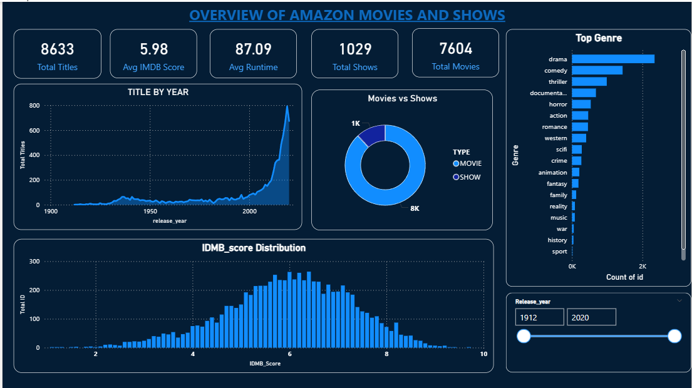

# amazon-prime-video-Show-analysis-powerBI
This project analyzes Amazon Prime Movies and TV Shows using Power BI, based on two datasets: a titles dataset with over 9,000 unique movies and shows (15 columns of information) and a credits dataset containing more than 124,000 actor and director records (5 columns). The data includes details such as title names, show types, release years, certifications, genres, production countries, IMDb/TMDB ratings, and cast information.

The workflow involved thorough data cleaning, correcting data types, handling missing values, and building accurate relationships between the two datasets. After preparing the data model, multiple interactive dashboards were created to reveal insights related to genre trends, rating patterns, content popularity, release-year analysis, and contributions of actors and directors. Users can explore the dashboards through filters, slicers, and drill-through pages for deeper insights into individual titles and cast members.

This project highlights strong skills in Power BI, data transformation, analysis, and visualization. It demonstrates the ability to convert large raw datasets into clear, insightful, and interactive dashboards that support meaningful understanding of Amazon Prime’s content library.

**🚀 Tools & Technologies**

1) Power BI (Visualization & Modelling)

2) Power Query (ETL & Data Cleaning)

3) DAX (Calculations & Measures)

4) Excel / CSV (Raw Data)

**📥 How to Use This Project**

1) Download the .pbix file from this repository.

2) Open it in Power BI Desktop.

3) Explore dashboards and interact with filters, slicers, and drill-through pages.

# Images

🧑‍💻 Author

Dravyesh Upadhyay

Data Analyst | Power BI | SQL | Python
[]
